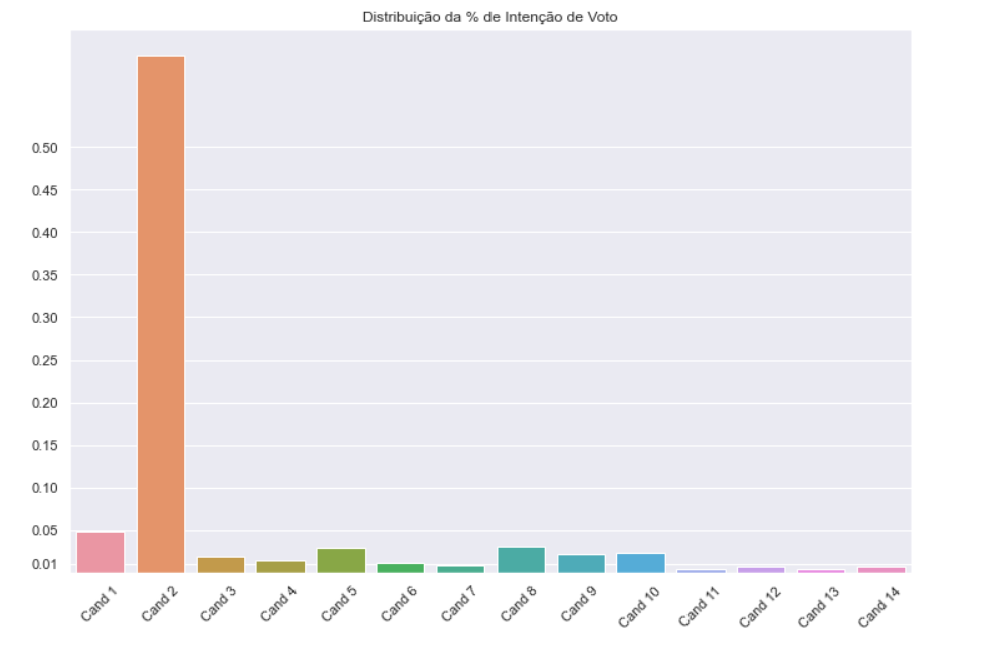
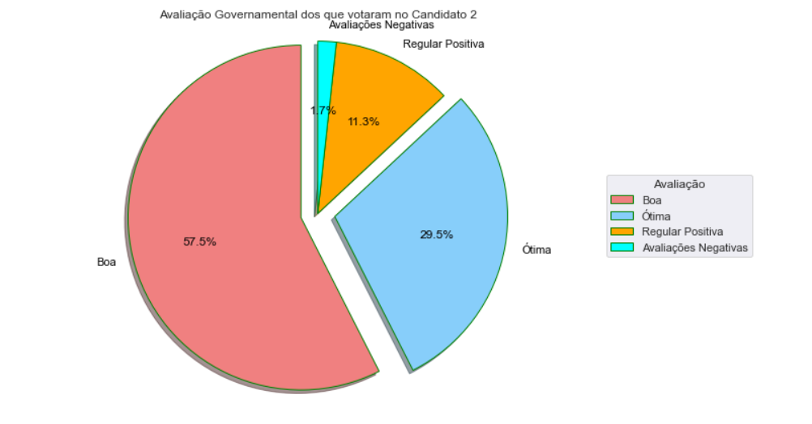

# Processo-Quaest

### Objetivo: Este repositório tem por objetivo a realização da avaliação técnica proposto pela Quaest em seu processo seletivo para estagiário em Ciência de Dados. A avaliação é composta por três questões a respeito de uma base de dados composta por respostas de survay de eleitores.

 
Todas as explicações e códigos detalhados estarão dentro do notebook ''. É só abrir e conferir
Abaixo terá um resumo das respostas das questões, apenas no formato de texto/gráficos.
 
 

### Questão 1 - Qual o % de intenção de voto para cada candidato?
### Resposta:  
Utilizando o data['voto1'].value_counts() é possível ver os valores únicos que este atributo pode assumir e suas respectivas quantidades.  
É possível ver a existência de 14 candidatos e dividindo suas respectivas intenções pela quantidade total de registros, temos:    
Candidato 1 = 42/ 1000 = 0,042% = 4.2%  
Candidato 2 = 523/ 1000 = 0,523% = 52.3%  
Candidato 3 = 16/ 1000 = 0,016% = 1.6%  
Candidato 4 = 12/ 1000 = 0,012% = 1.2%  
Candidato 5 = 25/ 1000 = 0,025% = 2.5%  
Candidato 6 = 10/ 1000 = 0,010% = 1.0%  
Candidato 7 = 7/ 1000 = 0,007% = 0.7%  
Candidato 8 = 26/ 1000 = 0,026% = 2.6%  
Candidato 9 = 19/ 1000 = 0,019% = 1.9%  
Candidato 10 = 20/ 1000 = 0,020% = 2.0%  
Candidato 11 = 3/ 1000 = 0,003% = 0.3%  
Candidato 12 = 6/ 1000 = 0,006% = 0.6%  
Candidato 13 = 3/ 1000 = 0,003% = 0.3%  
Candidato 14 = 6/ 1000 = 0,006% = 0.6%    

 

### Questão 2 - Qual o candidato com maior % de intenção de voto entre as MULHERES?
### Resposta:  

O Candidato 2 possui a maior porcentagem de intenção de votos entre as mulheres, o que corresponde a mais de 54% da intenção dos votos delas

### Questão 3 - O candidato que lidera as intenções de voto é o candidato de situação ou oposição ao governo ?
### Resposta:  
Considerando apenas as 523 pessoas que tem intenção de voto no Candidato 2 (é ele quem lidera), é perceptível que a avaliação que elas fizeram ao governo é extremamente positiva, visto que mais de 86% deles disseram que é "boa/ótima" e se incluir "regular positiva" somatiza quase toda a totalidade. Dessa forma, se eles avaliaram bem o governo e a intenção deles é realizar o voto no Candidato 2, então é muito provável que o mesmo seja o candidato de situação.   

 

